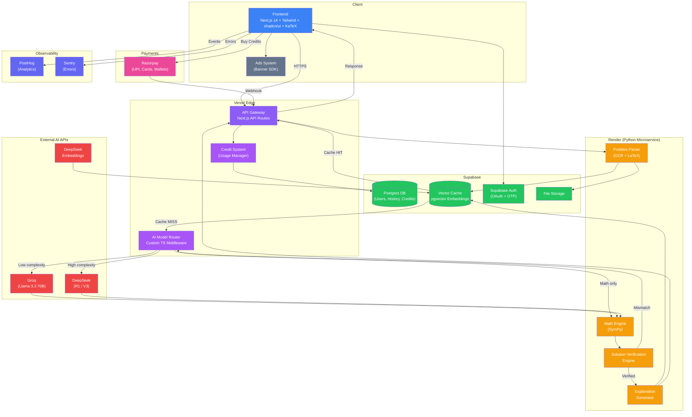

# Equated — System Architecture Document

> Derived from **Equated PRD v2.0** and **Tech Stack & Infrastructure Guide**

---

## 1. Core Product Requirements

| # | Requirement | Source |
|---|------------|--------|
| R1 | Accept STEM problems as typed text, LaTeX, images (OCR), and uploaded documents | PRD §3.1 |
| R2 | Produce structured step-by-step solutions (Interpretation → Concept → Steps → Answer → Summary) | PRD §3.2 |
| R3 | Route each problem to the most cost-effective AI model | PRD §5.1 |
| R4 | Cache questions via vector similarity to avoid redundant API calls (target 30-60% hit rate) | PRD §5.3 |
| R5 | Perform symbolic math computation (algebra, calculus, matrices) via a dedicated engine — never the LLM | PRD §5.4 |
| R6 | Verify every solution before delivery (math engine + cross-model checks) | PRD §5.5 |
| R7 | Maintain conversation context for follow-up questions | PRD §5.7 |
| R8 | Pre-populate a solved-problem library for instant zero-cost answers | PRD §5.8 |
| R9 | Free tier: 5-7 solves/day; monetize via credit packs (₹10 / 30 solves) | PRD §8 |
| R10 | Non-intrusive banner ads on solution pages to subsidize free tier | PRD §8.4 |
| R11 | Internal analytics: topic trends, model accuracy, cache hit rates, cost-per-solve | PRD §5.9 |
| R12 | Future stages: hint-based learning, mistake detection, visualizations, study tools | PRD §6 |

---

## 2. Core AI Capabilities

| Capability | Description | Implementation |
|-----------|-------------|----------------|
| **Problem Classification** | Detect subject (math, physics, chemistry, engineering) and complexity (low / high) | Custom TypeScript router (~200 LOC) |
| **Multi-Model Routing** | Select cheapest model per task: Groq free → DeepSeek → SymPy-only | Router middleware in Next.js API route |
| **Symbolic Computation** | Algebra, calculus, equation solving, matrix ops — guaranteed correctness | SymPy on FastAPI microservice |
| **Solution Verification** | Math-engine cross-check + optional cross-model comparison; regenerate on mismatch | Verification Engine (Python) |
| **Structured Explanation** | Convert raw output into pedagogical format with steps, concepts, and alternatives | Explanation Generator (prompt engineering) |
| **Semantic Caching** | Embed questions → pgvector similarity search → serve cached solution if match ≥ threshold | Supabase pgvector + DeepSeek Embeddings |
| **OCR & Parsing** | Image → text (Tesseract) and image → LaTeX (pix2tex) | Python microservice on Render |
| **Conversation Context** | Maintain per-session state so follow-ups reference the active solution | Context Engine (session store) |

---

## 3. System Components

### 3.1 Component Registry

| Component | Technology | Hosting | Free Tier Limit | Upgrade Path |
|-----------|-----------|---------|-----------------|--------------|
| **Frontend** | Next.js 14 + Tailwind + shadcn/ui + KaTeX | Vercel | Generous free tier | Pro ($20/mo) |
| **API Gateway** | Next.js API Routes | Vercel (same deploy) | Included | — |
| **AI Model Router** | Custom TS middleware | Vercel (API route) | — | — |
| **Multi-Model AI Layer** | DeepSeek R1/V3, Groq (Llama 3.3 70B) | Cloud APIs | Groq: 14,400 req/day | Add Claude/GPT-4 |
| **Math Engine** | SymPy on FastAPI | Render | Free tier (cold starts) | Starter ($7/mo) |
| **Problem Parser / OCR** | Tesseract + pix2tex | Render (same service) | Free | Mathpix ($0.004/call) |
| **Question Cache (Vector)** | Supabase pgvector + DeepSeek Embeddings | Supabase | 500 MB DB | Pinecone at 10M+ |
| **Database** | Supabase Postgres | Supabase | 500 MB / 50k MAU | Pro ($25/mo) |
| **Auth** | Supabase Auth (Email OTP + Google OAuth) | Supabase | Included | — |
| **File Storage** | Supabase Storage | Supabase | 1 GB | Pro plan |
| **Credit System** | Usage Manager module | Next.js + Supabase | — | — |
| **Ads System** | Non-intrusive banner ads | Frontend (ad network SDK) | — | — |
| **Payments** | Razorpay | Razorpay | No monthly fee; 1.8% + GST per txn | — |
| **Analytics** | PostHog | PostHog cloud | 1M events/mo | Paid plans |
| **Error Monitoring** | Sentry | Sentry cloud | 5,000 errors/mo | Paid plans |

---

## 4. Data Flow

### 4.1 Primary Solve Flow

```
Student ──(text / image / LaTeX)──▶ Next.js Frontend
                                        │
                                        ▼
                                  API Gateway (Next.js API Route)
                                        │
                                        ▼
                              ┌── Problem Parser (Render) ──┐
                              │   • OCR (Tesseract/pix2tex) │
                              │   • Subject tagging          │
                              │   • Format normalization     │
                              └─────────────┬───────────────┘
                                            ▼
                              ┌── Question Cache (pgvector) ─┐
                              │   Embed → Similarity Search   │
                              ├── HIT  → Cached Solution ────▶ Response
                              └── MISS ──────┬───────────────┘
                                             ▼
                              ┌── AI Model Router ───────────┐
                              │   classify(complexity)        │
                              │   low  → Groq (free)          │
                              │   high → DeepSeek R1 (~$0.001)│
                              │   math → SymPy (free)         │
                              └─────────────┬────────────────┘
                                            ▼
                                    Math Engine (SymPy)
                                            │
                                            ▼
                                Solution Verification Engine
                                            │
                                            ▼
                                  Explanation Generator
                                            │
                              ┌─────────────┴─────────────┐
                              ▼                           ▼
                     Store in Cache               Response → Student
```

### 4.2 Supporting Flows

| Flow | Path |
|------|------|
| **Auth** | Frontend → Supabase Auth (OAuth / OTP) → JWT → API routes |
| **Credit Purchase** | Frontend → Razorpay SDK → Webhook → Supabase (credits table) |
| **Credit Check** | API route → Usage Manager → Supabase (daily count + credits) → allow / block |
| **Ads** | Frontend loads ad network SDK → renders banner on solution page |
| **Analytics** | Frontend + API → PostHog (events) + Sentry (errors) |
| **File Upload** | Frontend → Supabase Storage → URL passed to Problem Parser |

---

## 5. High-Level Architecture Diagram



---

## 6. Component Interaction Matrix

| From ↓ / To → | Frontend | API GW | Router | Cache | AI APIs | Math Engine | DB | Payments | Analytics |
|---|---|---|---|---|---|---|---|---|---|
| **Frontend** | — | ✔ | — | — | — | — | — | ✔ | ✔ |
| **API Gateway** | ✔ | — | ✔ | ✔ | — | — | ✔ | ✔ | — |
| **Router** | — | — | — | — | ✔ | ✔ | — | — | — |
| **Cache** | — | ✔ | ✔ | — | — | — | ✔ | — | — |
| **AI APIs** | — | — | — | — | — | ✔ | — | — | — |
| **Math Engine** | — | — | — | — | — | — | — | — | — |
| **DB** | — | — | — | — | — | — | — | — | — |

---

## 7. Cost Envelope

| Phase | Monthly Infra | AI API | Total |
|-------|--------------|--------|-------|
| **MVP (0-500 DAU)** | $0 | $0 – $8 (with cache) | **$0 – $8** |
| **Early traction (500 DAU)** | $0 | ~$9 (60% cache) | **~$9** |
| **Break-even** | ~20 credit pack purchases/month covers all costs | | |

> [!TIP]
> The Groq free tier alone covers 14,400 requests/day. Combined with 50-60% cache hit rates, the effective AI cost approaches zero for the MVP phase.

---

## 8. Key Architecture Decisions

1. **Monorepo MVP** — Next.js API routes eliminate a separate backend server, reducing operational complexity to a single Vercel deploy.
2. **Model-agnostic router** — Any AI model can be swapped via config; no vendor lock-in.
3. **Supabase as 4-in-1** — Postgres + Auth + Storage + pgvector replaces four separate services.
4. **SymPy for correctness** — LLMs never perform arithmetic; all math is delegated to a symbolic engine.
5. **Cache-first pipeline** — Every question hits the vector cache before invoking any AI, targeting 30-60% cost savings at scale.
6. **Component independence** — Each layer (frontend, AI, math, cache, payments) can be upgraded or replaced without architectural changes.
